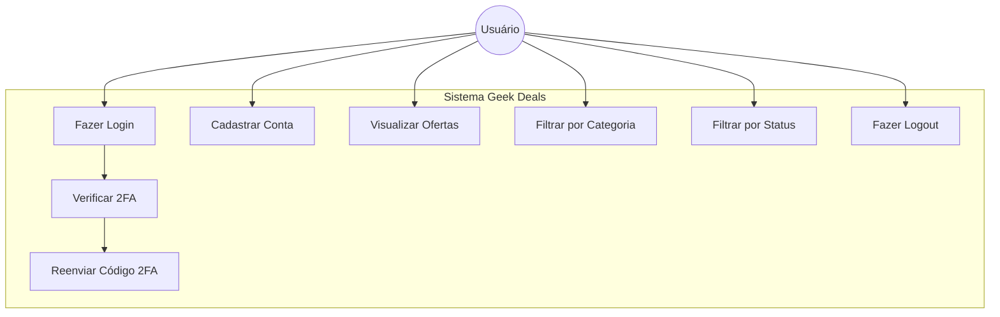
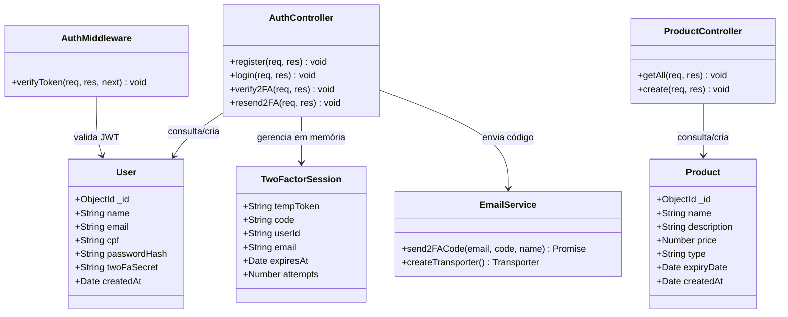
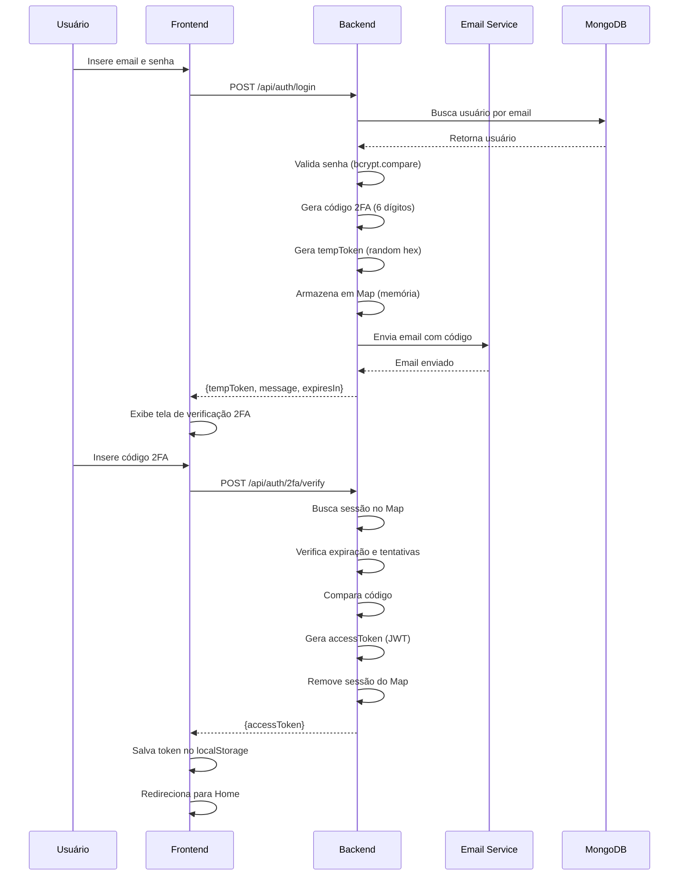
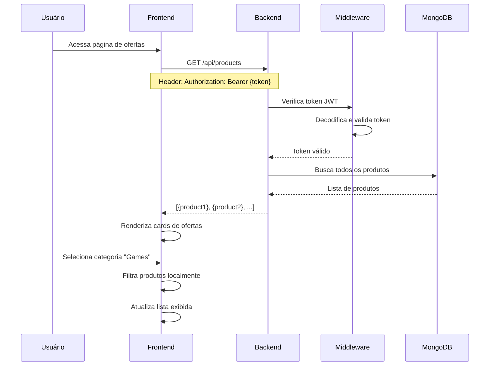
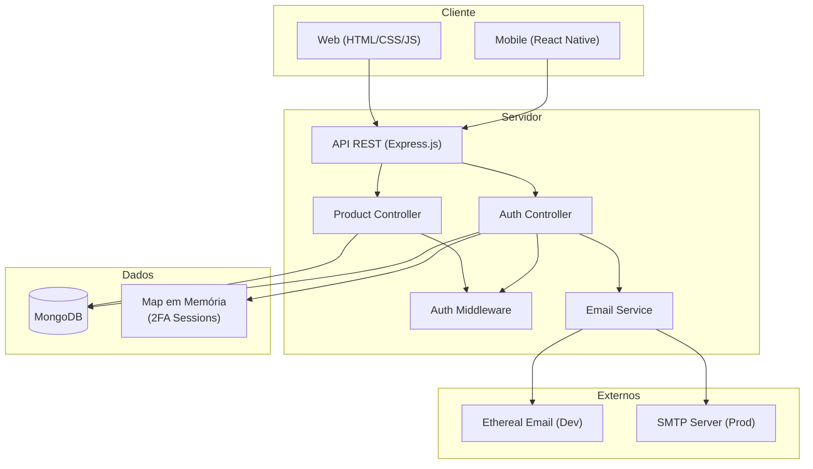

# Geek Deals - Diagramas UML

Documentação técnica do projeto Geek Deals para a disciplina de Aplicações Web e Mobile.

---

## 1. Diagrama de Casos de Uso



### Descrição dos Casos de Uso

| Caso de Uso | Descrição |
|-------------|-----------|
| **Fazer Login** | Usuário entra com email e senha para acessar o sistema |
| **Verificar 2FA** | Usuário insere código de 6 dígitos enviado por email |
| **Cadastrar Conta** | Novo usuário cria conta com nome, CPF, email e senha |
| **Visualizar Ofertas** | Usuário visualiza lista de ofertas disponíveis |
| **Filtrar por Categoria** | Usuário filtra ofertas por: Games, Hardware, Colecionáveis, Acessórios |
| **Filtrar por Status** | Usuário filtra ofertas ativas ou expiradas |
| **Fazer Logout** | Usuário encerra sessão |
| **Reenviar Código 2FA** | Usuário solicita novo código de verificação |

---

## 2. Diagrama de Classes



---

## 3. Diagrama de Sequência - Login com 2FA



---

## 4. Diagrama de Sequência - Visualizar Ofertas



---

## 5. Arquitetura do Sistema



---

## 6. Modelo de Dados

### User
```json
{
  "_id": "ObjectId",
  "name": "String (required)",
  "email": "String (required, unique)",
  "cpf": "String (required, unique)",
  "passwordHash": "String (required, bcrypt)",
  "twoFaSecret": "String (null)",
  "createdAt": "Date (default: now)"
}
```

### Product
```json
{
  "_id": "ObjectId",
  "name": "String (required)",
  "description": "String (required)",
  "price": "Number (required)",
  "type": "String (required: game|hardware|collectible|accessory)",
  "expiryDate": "Date (required)",
  "createdAt": "Date (default: now)"
}
```

---

## 7. Endpoints da API

| Método | Rota | Descrição | Autenticação |
|--------|------|-----------|--------------|
| POST | `/api/auth/register` | Cadastro de usuário | Não |
| POST | `/api/auth/login` | Login (retorna tempToken) | Não |
| POST | `/api/auth/2fa/verify` | Verifica código 2FA | Não |
| POST | `/api/auth/2fa/resend` | Reenvia código 2FA | Não |
| GET | `/api/products` | Lista todas as ofertas | Sim (JWT) |
| POST | `/api/products` | Cria nova oferta | Sim (JWT) |

---

## Tecnologias Utilizadas

| Camada | Tecnologia |
|--------|------------|
| **Frontend Web** | HTML5, CSS3, JavaScript |
| **Frontend Mobile** | React Native, Expo |
| **Backend** | Node.js, Express.js |
| **Banco de Dados** | MongoDB |
| **Autenticação** | JWT, bcrypt |
| **Email** | Nodemailer, Ethereal (dev) |

---

**Unifacisa - 2025**
